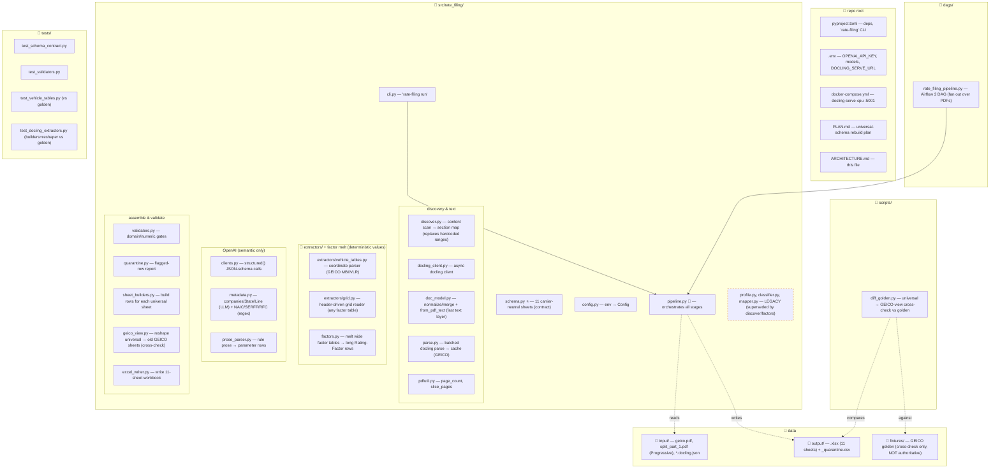
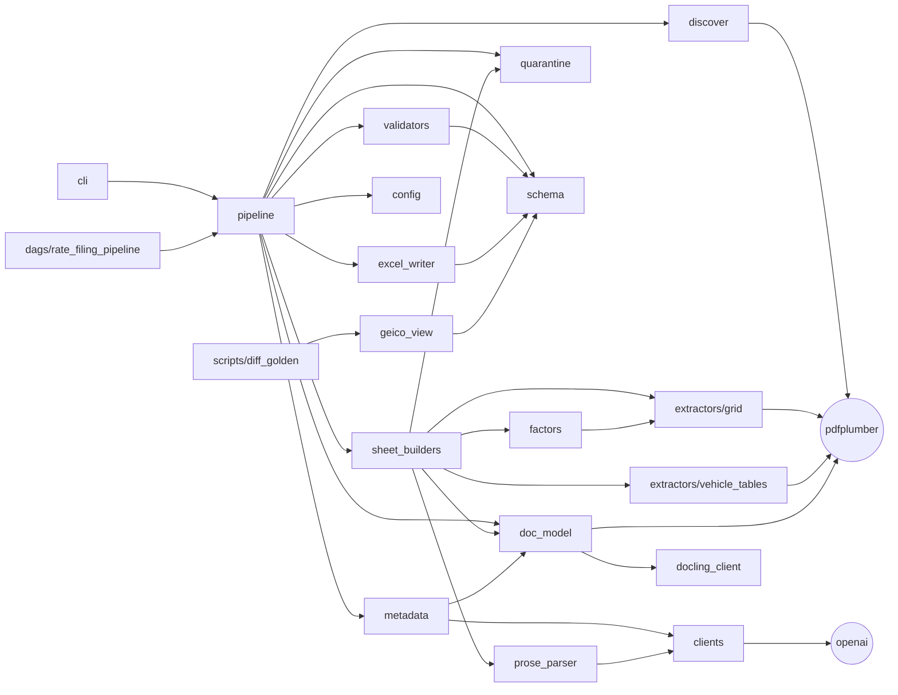

# Architecture (carrier-agnostic)

Three Mermaid diagrams: (1) folder/file map, (2) the runtime data flow, (3) the
module dependency graph. The pipeline is **carrier-agnostic**: section locations
are *discovered* from page content (no hardcoded page ranges), and the output is
a **carrier-neutral, long-format** workbook (coverages/labels are cell values,
not columns), so GEICO, Progressive, and other carriers all stack into the same
sheets. See PLAN.md for the design rationale.

Key principle (unchanged): the LLM only does semantic work (identity names,
prose→parameters). Every number is copied verbatim by deterministic Python.
Anything ambiguous goes to 10_Quarantine — never dropped, never guessed.

---

## 1. Folder & file map



---

## 2. Runtime data flow (one `pipeline.run(pdf)` call)

```mermaid
flowchart TD
    START(["rate-filing run <pdf>"]) --> P["pipeline.run()"]

    subgraph EXT["external (optional)"]
        DS["🐳 docling-serve :5001"]
        OAI["☁️ OpenAI API"]
    end

    P --> D["1 · discover.discover()<br/>content scan → kinds:<br/>identity / rule / factor_table /<br/>vehicle_symbols / territory_map"]
    D --> TXT{"docling cache present?"}
    TXT -->|yes (GEICO)| C1["load cached DoclingDocument"]
    TXT -->|no (Progressive)| C2["doc_model.from_pdf_text (pdfplumber)"]
    C1 --> ID
    C2 --> ID

    ID["2 · metadata.detect<br/>companies/State/Line (LLM) +<br/>NAIC/SERFF/RFC (regex, never LLM)"]
    ID -->|names| OAI

    ID --> EXTRACT
    subgraph EXTRACT["3 · EXTRACTION (deterministic values)"]
        direction TB
        RULES["sheet_builders.build_rules → 02_Rules (verbatim text)"]
        PARM["build_rule_parameters → 03 (prose→params, bounded)"]
        FAC["build_rating_factors:<br/>class factors (banner) + grid.melt over factor pages → 04"]
        TERR["build_territory → 05 (ZIP→territory, if a discrete map exists)"]
        VEH["build_vehicle_symbols → 06 (MBI/VLR by coordinates)"]
        PARM --> OAI
    end

    EXTRACT --> G["4 · validation gates<br/>MBI domain · ZIP 5-digit · factor-range"]
    G -->|pass| OK["clean rows"]
    G -->|fail/ambiguous| Q["10_Quarantine + CSV"]

    OK --> W["5 · excel_writer.write_workbook (11 sheets)"]
    Q --> W
    D --> SM["09_Source_Map (provenance)"] --> W
    W --> OUT["📄 output/<pdf>.xlsx + <pdf>_quarantine.csv"]

    SCHEMA["schema.py (contract)"] -.governs.-> EXTRACT
    SCHEMA -.governs.-> W
```

---

## 3. Module dependency graph



---

## Notes on current state (honest)

- **`schema.py`** is the contract: 11 carrier-neutral sheets. Coverages/labels
  are cell values, so a new carrier or factor type adds *rows*, never columns.
- **`discover.py`** replaces the old hardcoded `profile.py` page ranges. Verified
  on both filings: it finds GEICO's vehicle/territory blocks and Progressive's
  rule/factor regions with no per-carrier tuning.
- **`grid.py` + `factors.py`** read any whitespace factor table by detecting
  columns from data-token alignment, then melt it into long Rating-Factor rows.
- **`vehicle_tables.py`** keeps GEICO's byte-exact coordinate parser (its data
  pages have no per-page header). Symbol type (MBI/Liability) is read from the
  page, not hardcoded.
- **`geico_view.py`** is cross-check only. The golden .xlsx was produced by
  another model run, so a mismatch means "check the PDF", not "we are wrong".
- **`profile.py`, `classifier.py`, `mapper.py`** are LEGACY — superseded by
  `discover.py` (discovery) and `factors.py` (deterministic melt). Kept for
  reference; `pipeline.run()` does not import them.
- **Determinism:** discovery, grid/coordinate extraction, and melt are
  deterministic; only identity names and prose→parameter steps use the LLM.
```
